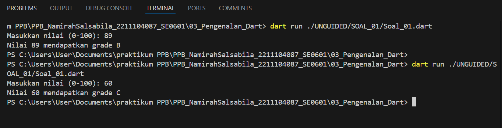

## Tugas Percabangan

Buatlah sebuah fungsi dalam Dart yang menerima sebuah nilai dari user, lalu melakukan
percabangan untuk memberikan output berdasarkan kondisi berikut:

Deskripsi :

a. Jika nilai lebih besar dari 70, program harus mereturn "Nilai A". 

b. Jika nilai lebih besar dari 40 tetapi kurang atau sama dengan 70, program harus
mereturn "Nilai B".

c. Jika nilai lebih besar dari 0 tetapi kurang atau sama dengan 40, program harus
mereturn "Nilai C".

d. Jika nilai tidak memenuhi semua kondisi di atas, program harus mereturn teks
kosong.

Sampel Input: 80

Sampel Output: 80 merupakan Nilai A

Sampel Input: 5

Sampel Output: 50 merupakan Nilai B

## Screenshots Hasil Program

