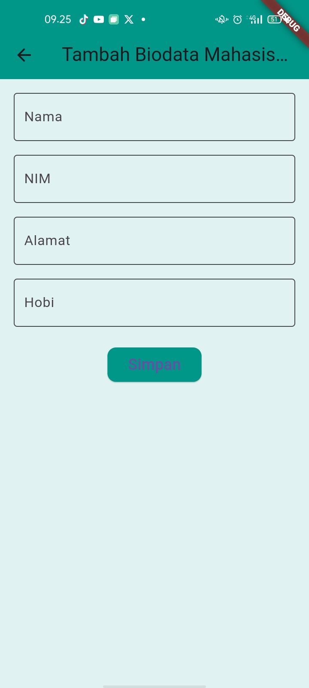
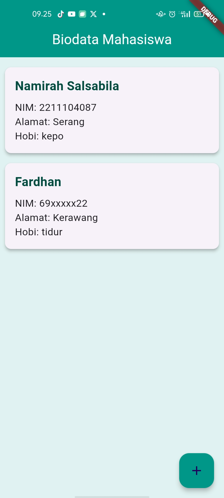

UNGUIDED
## Screenshots

Namirah Salsabila
2211104087
S1SE0601

plikasi ini adalah program Flutter sederhana untuk menyimpan dan menampilkan biodata mahasiswa menggunakan SQLite. Data mahasiswa (nama, NIM, alamat, dan hobi) dapat ditambahkan melalui form di halaman Tambah Mahasiswa dan ditampilkan dalam daftar di halaman utama dengan desain menarik menggunakan Card dan tema warna teal. SQLite digunakan untuk menyimpan data secara lokal, sehingga data tetap tersedia tanpa internet. Dengan fitur tambah (Create) dan baca data (Read), aplikasi ini cocok untuk belajar dasar Flutter dan SQLite.

