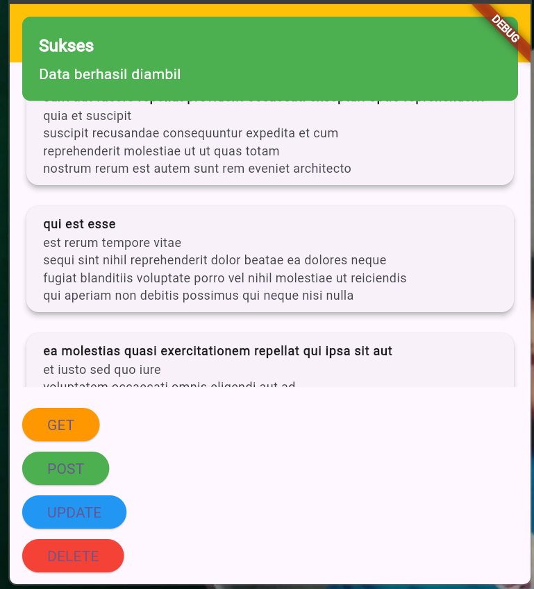
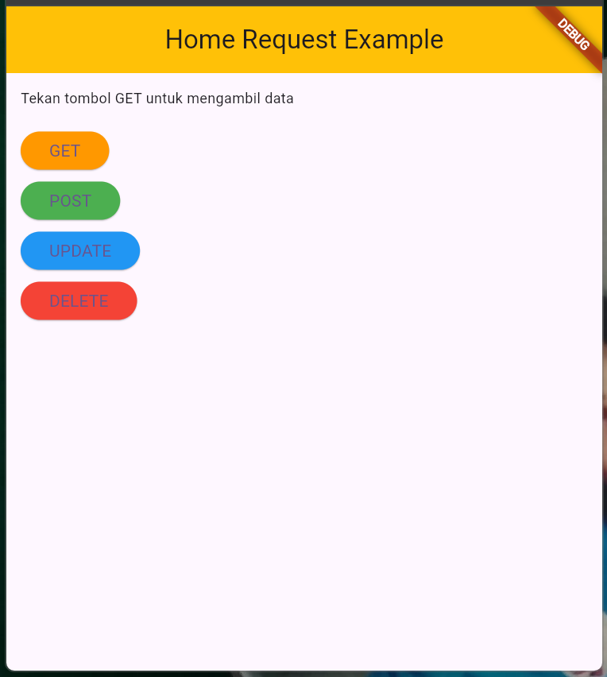

## GUIDED

## Penjelasan Program
Berikut adalah penjelasan **kode lengkap** beserta penjelasan terperinci yang dapat digunakan untuk laporan:

---

### **1. File `main.dart`**
#### **Kode**
```dart
import 'package:flutter/material.dart';
import 'package:praktikum14/screens/home_screen.dart';

void main() {
  runApp(const MyApp());
}

class MyApp extends StatelessWidget {
  const MyApp({super.key});

  @override
  Widget build(BuildContext context) {
    return MaterialApp(
      title: 'Flutter Demo',
      theme: ThemeData(
        colorScheme: ColorScheme.fromSeed(seedColor: Colors.deepPurple),
        useMaterial3: true,
      ),
      home: HomeScreen(),
    );
  }
}
```

#### **Penjelasan**
1. **`main()`**:
   - Fungsi utama aplikasi yang memanggil `runApp()` untuk menjalankan widget root `MyApp`.
2. **`MyApp`**:
   - Sebuah `StatelessWidget` yang bertindak sebagai widget root.
   - Menggunakan `MaterialApp` untuk mendefinisikan properti aplikasi seperti:
     - **`title`**: Menentukan judul aplikasi.
     - **`theme`**: Mengatur tema aplikasi berbasis warna ungu.
     - **`home`**: Menentukan halaman utama aplikasi, yaitu `HomeScreen`.

---

### **2. File `api_server.dart`**
#### **Kode**
```dart
import 'dart:convert';
import 'package:http/http.dart' as http;

class ApiService {
  final String baseUrl = "https://jsonplaceholder.typicode.com";
  List<dynamic> posts = [];

  Future<void> fetchPosts() async {
    final response = await http.get(Uri.parse('$baseUrl/posts'));
    if (response.statusCode == 200) {
      posts = json.decode(response.body);
    } else {
      throw Exception('Failed to load posts');
    }
  }

  Future<void> createPost() async {
    final response = await http.post(
      Uri.parse('$baseUrl/posts'),
      headers: {'Content-Type': 'application/json'},
      body: json.encode({
        'title': 'Flutter Post',
        'body': 'Ini contoh POST.',
        'userId': 1,
      }),
    );
    if (response.statusCode == 201) {
      posts.add({
        'title': 'Flutter Post',
        'body': 'Ini contoh POST.',
        'id': posts.length + 1,
      });
    } else {
      throw Exception('Failed to create post');
    }
  }

  Future<void> updatePost() async {
    final response = await http.put(
      Uri.parse('$baseUrl/posts/1'),
      body: json.encode({
        'title': 'Updated Title',
        'body': 'Updated Body',
        'userId': 1,
      }),
    );
    if (response.statusCode == 200) {
      final updatedPost = posts.firstWhere((post) => post['id'] == 1);
      updatedPost['title'] = 'Updated Title';
      updatedPost['body'] = 'Updated Body';
    } else {
      throw Exception('Failed to update post');
    }
  }

  Future<void> deletePost() async {
    final response = await http.delete(
      Uri.parse('$baseUrl/posts/1'),
    );
    if (response.statusCode == 200) {
      posts.removeWhere((post) => post['id'] == 1);
    } else {
      throw Exception('Failed to delete post');
    }
  }
}
```

#### **Penjelasan**
1. **`ApiService`**:
   - Sebuah kelas untuk mengelola interaksi dengan API.
   - **`baseUrl`**: Alamat dasar API publik.
   - **`posts`**: Menyimpan data yang diambil dari API.
2. **Fungsi CRUD**:
   - **`fetchPosts()`**:
     - Menggunakan metode `GET` untuk mengambil data dari API.
     - Jika berhasil (`statusCode == 200`), data JSON disimpan ke `posts`.
   - **`createPost()`**:
     - Menggunakan metode `POST` untuk menambahkan data baru.
     - Data dikirim dalam format JSON.
     - Jika berhasil (`statusCode == 201`), data baru ditambahkan ke daftar `posts`.
   - **`updatePost()`**:
     - Menggunakan metode `PUT` untuk memperbarui data dengan `id = 1`.
     - Jika berhasil, data lokal diperbarui sesuai hasil server.
   - **`deletePost()`**:
     - Menggunakan metode `DELETE` untuk menghapus data dengan `id = 1`.

---

### **3. File `home_screen.dart`**
#### **Kode**
```dart
import 'package:flutter/material.dart';
import 'package:praktikum14/services/api_server.dart';

class HomeScreen extends StatefulWidget {
  const HomeScreen({super.key});

  @override
  State<HomeScreen> createState() => _HomeScreenState();
}

class _HomeScreenState extends State<HomeScreen> {
  List<dynamic> _posts = [];
  bool _isLoading = false;
  final ApiService _apiService = ApiService();

  void _showSnackBar(String message) {
    ScaffoldMessenger.of(context).showSnackBar(
      SnackBar(content: Text(message)),
    );
  }

  Future<void> _fetchPosts() async {
    await _handleApiOperation(
      _apiService.fetchPosts(),
      'Data berhasil diambil!',
    );
  }

  Future<void> _handleApiOperation(
      Future<void> operation, String successMessage) async {
    setState(() {
      _isLoading = true;
    });

    try {
      await operation;
      setState(() {
        _posts = _apiService.posts;
      });
      _showSnackBar(successMessage);
    } catch (e) {
      _showSnackBar('Error: $e');
    } finally {
      setState(() {
        _isLoading = false;
      });
    }
  }

  @override
  void initState() {
    super.initState();
    _fetchPosts();
  }

  @override
  Widget build(BuildContext context) {
    return Scaffold(
        appBar: AppBar(
          title: const Text('Home Request Example'),
          centerTitle: true,
          backgroundColor: Colors.amber,
        ),
        body: Padding(
          padding: const EdgeInsets.all(12.0),
          child: Column(
            crossAxisAlignment: CrossAxisAlignment.start,
            children: [
              _isLoading
                  ? const Center(child: CircularProgressIndicator())
                  : _posts.isEmpty
                      ? const Text(
                          "Tekan tombol GET untuk mengambil data",
                          style: TextStyle(fontSize: 12),
                        )
                      : Expanded(
                          child: ListView.builder(
                            itemCount: _posts.length,
                            itemBuilder: (context, index) {
                              return Padding(
                                padding: const EdgeInsets.only(bottom: 12.0),
                                child: Card(
                                  elevation: 4,
                                  child: ListTile(
                                    title: Text(
                                      _posts[index]['title'],
                                      style: const TextStyle(
                                          fontWeight: FontWeight.bold,
                                          fontSize: 12),
                                    ),
                                    subtitle: Text(
                                      _posts[index]['body'],
                                      style: const TextStyle(fontSize: 12),
                                    ),
                                  ),
                                ),
                              );
                            },
                          ),
                        ),
              const SizedBox(height: 20),
              ElevatedButton(
                onPressed: () => _handleApiOperation(
                    _apiService.fetchPosts(), 'Data berhasil diambil!'),
                style: ElevatedButton.styleFrom(backgroundColor: Colors.orange),
                child: const Text('GET'),
              ),
              const SizedBox(height: 10),
              ElevatedButton(
                onPressed: () => _handleApiOperation(
                    _apiService.createPost(), 'Data berhasil ditambahkan!'),
                style: ElevatedButton.styleFrom(backgroundColor: Colors.green),
                child: const Text('POST'),
              ),
              const SizedBox(height: 10),
              ElevatedButton(
                onPressed: () => _handleApiOperation(
                    _apiService.updatePost(), 'Data berhasil diperbarui!'),
                style: ElevatedButton.styleFrom(backgroundColor: Colors.blue),
                child: const Text('UPDATE'),
              ),
              const SizedBox(height: 10),
              ElevatedButton(
                onPressed: () => _handleApiOperation(
                    _apiService.deletePost(), 'Data berhasil dihapus!'),
                style: ElevatedButton.styleFrom(backgroundColor: Colors.red),
                child: const Text('DELETE'),
              ),
            ],
          ),
        ));
  }
}
```

#### **Penjelasan**
1. **`_fetchPosts()`**:
   - Mengambil data dari API saat aplikasi pertama kali dimuat.
2. **CRUD Buttons**:
   - Menggunakan tombol `ElevatedButton` untuk menjalankan operasi CRUD.
3. **UI**:
   - Menampilkan daftar data menggunakan `ListView.builder`.
   - Indikator loading (`CircularProgressIndicator`) muncul saat operasi berlangsung.

## Hasil Output Guided
- Tampilan Halaman Awal

- Tampilan Get

- Tampilan Post

- Tampilan Update

- Tampilan Delete


## UNGUIDED

## Penjelasan Program
### **Laporan Singkat Penjelasan Kode**

Aplikasi ini menggunakan **Flutter** dan **GetX** untuk melakukan operasi **CRUD** (Create, Read, Update, Delete) terhadap data dari API **JSONPlaceholder**. Operasi API dilakukan menggunakan pustaka `http`, dengan antarmuka pengguna yang responsif dan terintegrasi notifikasi interaktif.

#### **Fungsi Utama:**
1. **GET**: Mengambil data dari server dan menampilkannya di layar.
2. **POST**: Menambahkan data baru ke server dan memperbarui daftar di UI.
3. **PUT**: Memperbarui data yang ada di server dan UI.
4. **DELETE**: Menghapus data dari server dan menghapusnya dari UI.

#### **Fitur Utama:**
- **State Management**: Menggunakan **GetX** untuk mengelola data (`posts`) dan status loading (`isLoading`).
- **Notifikasi Interaktif**: Menggunakan `Get.snackbar` untuk menampilkan notifikasi di atas layar. Pesan menyesuaikan jenis operasi (sukses/gagal).
- **Indikator Loading**: Menampilkan loading saat operasi API berlangsung untuk memberikan feedback visual.

#### **Alur Kerja Singkat:**
1. Pengguna melihat daftar data dari server di layar.
2. Tombol CRUD memungkinkan pengguna melakukan operasi terhadap data:
   - Tombol **GET** mengambil data.
   - Tombol **POST** menambahkan data baru.
   - Tombol **PUT** memperbarui data tertentu.
   - Tombol **DELETE** menghapus data tertentu.
3. Setelah setiap operasi, UI diperbarui secara otomatis, dan notifikasi muncul sebagai feedback.

Aplikasi ini cocok sebagai dasar untuk memahami integrasi API, manajemen state, dan pengalaman pengguna interaktif.

---

### **Kode Program**

#### **1. File `api_controller.dart`**

```dart
import 'dart:convert';
import 'package:http/http.dart' as http;
import 'package:get/get.dart';

class ApiController extends GetxController {
  var posts = <dynamic>[].obs;
  var isLoading = false.obs;
  final String baseUrl = 'https://jsonplaceholder.typicode.com';

  // GET data
  Future<void> fetchPosts() async {
    _setLoading(true);
    try {
      final response = await http.get(Uri.parse('$baseUrl/posts'));
      if (response.statusCode == 200) {
        posts.value = json.decode(response.body);
        _showSnackbar("Sukses", "Data berhasil diambil", Colors.green);
      } else {
        throw Exception('Failed to load posts');
      }
    } catch (e) {
      _showSnackbar("Error", e.toString(), Colors.red);
    } finally {
      _setLoading(false);
    }
  }

  // POST data
  Future<void> createPost() async {
    _setLoading(true);
    try {
      final response = await http.post(
        Uri.parse('$baseUrl/posts'),
        headers: {'Content-Type': 'application/json'},
        body: json.encode({
          'title': 'New Post',
          'body': 'This is a new post.',
          'userId': 1,
        }),
      );
      if (response.statusCode == 201) {
        posts.add({
          'title': 'New Post',
          'body': 'This is a new post.',
          'id': posts.length + 1,
        });
        _showSnackbar("Sukses", "Data berhasil ditambahkan", Colors.green);
      } else {
        throw Exception('Failed to create post');
      }
    } catch (e) {
      _showSnackbar("Error", e.toString(), Colors.red);
    } finally {
      _setLoading(false);
    }
  }

  // Update data
  Future<void> updatePost() async {
    _setLoading(true);
    try {
      final response = await http.put(
        Uri.parse('$baseUrl/posts/1'),
        headers: {'Content-Type': 'application/json'},
        body: json.encode({
          'title': 'Updated Post',
          'body': 'This post has been updated.',
          'userId': 1,
        }),
      );
      if (response.statusCode == 200) {
        posts.firstWhere((post) => post['id'] == 1)['title'] = 'Updated Post';
        posts.firstWhere((post) => post['id'] == 1)['body'] = 'This post has been updated.';
        _showSnackbar("Sukses", "Data berhasil diperbarui", Colors.green);
      } else {
        throw Exception('Failed to update post');
      }
    } catch (e) {
      _showSnackbar("Error", e.toString(), Colors.red);
    } finally {
      _setLoading(false);
    }
  }

  // Delete data
  Future<void> deletePost() async {
    _setLoading(true);
    try {
      final response = await http.delete(Uri.parse('$baseUrl/posts/1'));
      if (response.statusCode == 200) {
        posts.removeWhere((post) => post['id'] == 1);
        _showSnackbar("Sukses", "Data berhasil dihapus", Colors.green);
      } else {
        throw Exception('Failed to delete post');
      }
    } catch (e) {
      _showSnackbar("Error", e.toString(), Colors.red);
    } finally {
      _setLoading(false);
    }
  }

  // Menampilkan snackbar
  void _showSnackbar(String title, String message, Color bgColor) {
    Get.snackbar(
      title,
      message,
      backgroundColor: bgColor,
      colorText: Colors.white,
      snackPosition: SnackPosition.TOP,
      margin: const EdgeInsets.all(12),
      borderRadius: 8,
    );
  }

  // Mengatur status loading
  void _setLoading(bool value) {
    isLoading.value = value;
  }
}
```

#### **2. File `home_screen.dart`**

```dart
import 'package:flutter/material.dart';
import 'package:get/get.dart';
import 'api_controller.dart';

class HomeScreen extends StatelessWidget {
  final ApiController controller = Get.put(ApiController());

  @override
  Widget build(BuildContext context) {
    return Scaffold(
      appBar: AppBar(
        title: const Text('Flutter CRUD with API'),
        backgroundColor: Colors.orange,
        centerTitle: true,
      ),
      body: Padding(
        padding: const EdgeInsets.all(12.0),
        child: Column(
          children: [
            Obx(() {
              if (controller.isLoading.value) {
                return const Center(child: CircularProgressIndicator());
              } else if (controller.posts.isEmpty) {
                return const Text("Belum ada data.");
              } else {
                return Expanded(
                  child: ListView.builder(
                    itemCount: controller.posts.length,
                    itemBuilder: (context, index) {
                      return ListTile(
                        title: Text(controller.posts[index]['title']),
                        subtitle: Text(controller.posts[index]['body']),
                      );
                    },
                  ),
                );
              }
            }),
            const SizedBox(height: 20),
            ElevatedButton(
              onPressed: controller.fetchPosts,
              child: const Text('GET'),
            ),
            const SizedBox(height: 10),
            ElevatedButton(
              onPressed: controller.createPost,
              child: const Text('POST'),
            ),
            const SizedBox(height: 10),
            ElevatedButton(
              onPressed: controller.updatePost,
              child: const Text('UPDATE'),
            ),
            const SizedBox(height: 10),
            ElevatedButton(
              onPressed: controller.deletePost,
              child: const Text('DELETE'),
            ),
          ],
        ),
      ),
    );
  }
}
```


